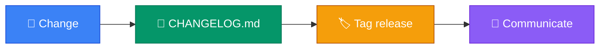

<p align="center">
  
</p>

<h1 align="center">changelog-keepachangelog</h1>

<p align="center">
  <strong>EN</strong> Bilingual Keep a Changelog template + category notes<br/>
  <strong>PT</strong> Template Keep a Changelog bilingue + notas de categorias
</p>

<p align="center">
  <a href="https://github.com/manansbdb/changelog-keepachangelog/blob/main/LICENSE"></a>
  
  
  <a href="#support--apoio"></a>
</p>

---

## What it does / Para que serve

| English | Português |
|---------|-----------|
| A ready **Keep a Changelog** template (EN+PT) plus category guidance. | Um template **Keep a Changelog** pronto (EN+PT) com guia de categorias. |
| Drop `CHANGELOG.md` into any repo and start recording releases. | Coloca o `CHANGELOG.md` em qualquer repo e regista releases. |



---

## Install / Instalação

### 1) Clone / Clona

```bash
git clone https://github.com/manansbdb/changelog-keepachangelog.git
cd changelog-keepachangelog
```

### 2) Copy into your repo / Copia para o teu repo

```bash
cp CHANGELOG.md /path/to/your-project/
cp categories.md /path/to/your-project/docs/changelog-categories.md
```

### Requirements / Requisitos

- `git`
- No runtime dependencies

---

## Quick start / Início rápido

```bash
git clone https://github.com/manansbdb/changelog-keepachangelog.git
cp changelog-keepachangelog/CHANGELOG.md ./CHANGELOG.md
# edit Unreleased section on every PR
```

---

## Contents / Conteúdos

| Path | Purpose / Função |
|------|------------------|
| `CHANGELOG.md` | Keep a Changelog template |
| `categories.md` | Added/Changed/Fixed notes |
| `SUPPORT.md` | Donations / Doações |

---

## Project layout / Estrutura

```text
changelog-keepachangelog/
├── docs/banner.svg
├── CHANGELOG.md
├── categories.md
├── SUPPORT.md
└── README.md
```

---

## Support / Apoio

Bitcoin donations welcome / Doações em Bitcoin bem-vindas:

```
bc1q0qfnlnxyum9u45stzxe0a7jnhtj4j0usfkqdjw
```

See [SUPPORT.md](./SUPPORT.md).

---

## License / Licença

[MIT](./LICENSE) © 2026 manansbdb
